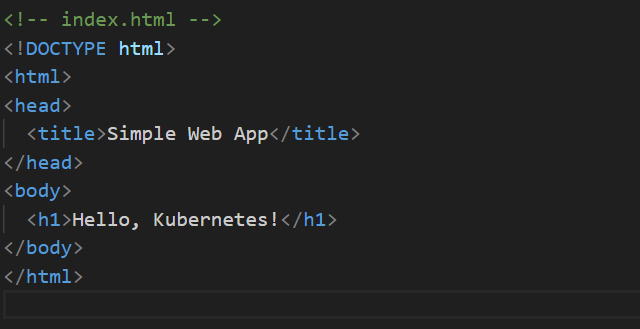
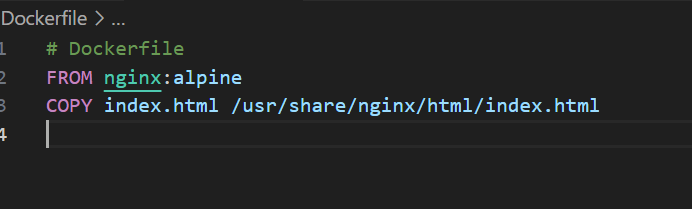
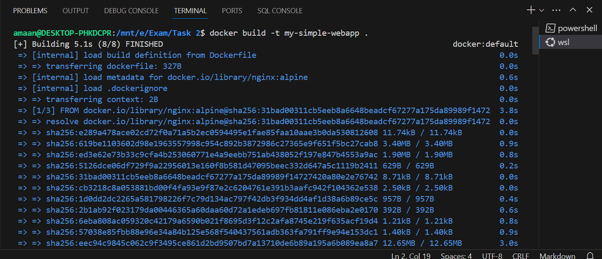
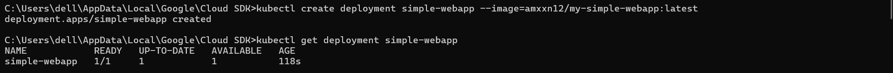
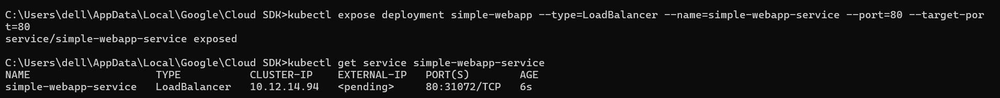
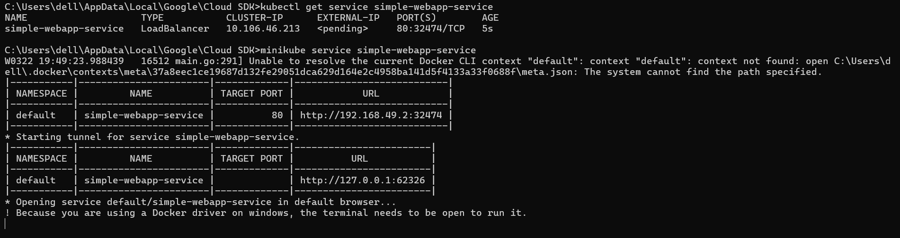
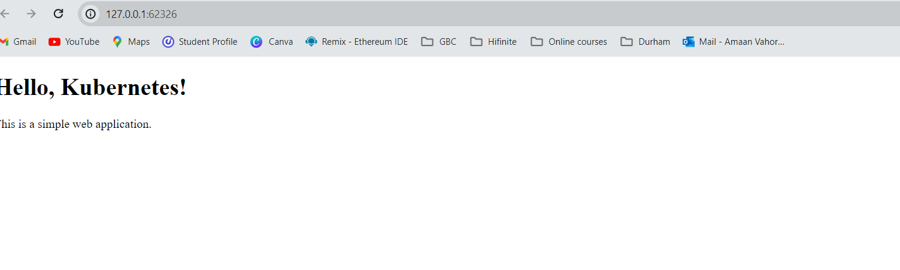
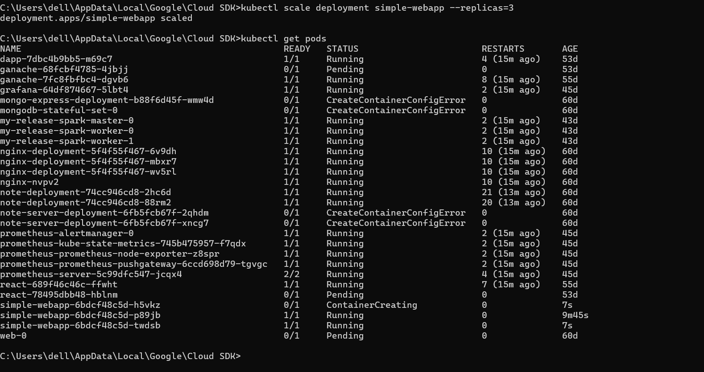
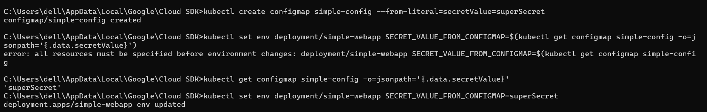
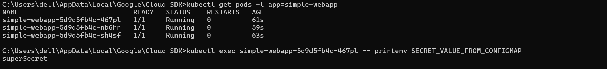

*Simple HTML file*

*Simple Docker File*

*Docker file build*

*Kubernetes Cluster deployment*

*Load Balancer added*

*cmd output of Loadbalancer*

*working Ui*

*3 replicas*

*Configure a ConfigMap environment variable in the deployment workload*

*Demonstrate you can execute into the pod and view the environment variable secret value*